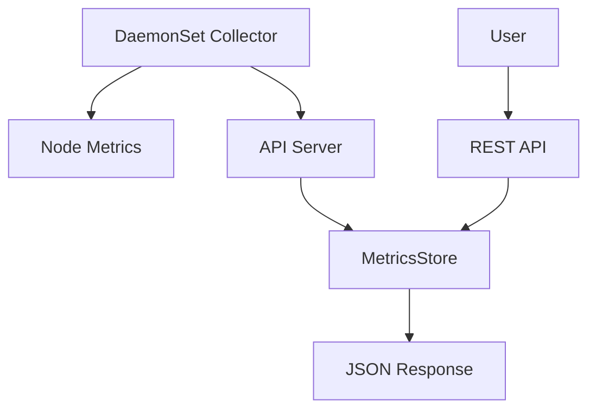

# Kubernetes 모니터링 서비스 (kubemonitor)

> WSL Ubuntu 22.04 LTS 환경에서 Kubernetes 기반 클라우드 모니터링 서비스를 완전 자동화로 구축하는 프로젝트

## 📋 프로젝트 개요

이 프로젝트는 Kubernetes 클러스터의 노드와 포드 리소스 사용량을 실시간으로 모니터링하는 완전한 시스템입니다. DaemonSet으로 배포되는 Collector가 각 노드의 CPU, 메모리, 디스크, 네트워크 메트릭을 수집하고, FastAPI 기반 서버를 통해 REST API로 제공합니다.

## 🏗️ 프로젝트 구조

```
kubemonitor/
├── collector/                 # 메트릭 수집기
│   ├── collector.py           # DaemonSet용 리소스 수집 스크립트
│   ├── requirements.txt       # Python 라이브러리 목록
│   └── Dockerfile.collector   # Collector용 Dockerfile
├── api/                       # API 서버
│   ├── main.py               # FastAPI 앱 엔트리포인트
│   ├── models.py             # Pydantic 모델 정의
│   ├── storage.py            # 시계열 데이터 저장소
│   ├── requirements.txt      # Python 라이브러리 목록
│   └── Dockerfile.api        # API 서버용 Dockerfile
├── deploy/                    # Kubernetes 배포
│   └── monitor.yaml          # 배포 매니페스트 (DaemonSet + Deployment + Service)
├── docs/                      # 문서
│   ├── report.md            # 구현 보고서
│   └── images/              # 스크린샷 및 다이어그램
├── .gitignore              # Git 무시 파일 목록
└── README.md               # 이 파일
```

## 🚀 빠른 시작

### 🎯 원클릭 자동 설치 (권장)

Clean Ubuntu 22.04 LTS에서 전체 시스템을 자동으로 구축하려면:

```bash
# 프로젝트 클론
git clone <repository-url>
cd kubemonitor

# 스크립트 실행 권한 부여
chmod +x scripts/*.sh

# 전체 자동 설치 (개발환경 구축 + 빌드 + 배포 + 테스트)
./scripts/setup-all.sh
```

### 📋 단계별 수동 설치

각 단계를 개별적으로 실행하려면:

```bash
# 1단계: 개발 환경 구축 (Clean Ubuntu 기준)
./scripts/01-setup-environment.sh

# 2단계: Docker 이미지 빌드
./scripts/02-build-images.sh

# 3단계: Kubernetes 배포
./scripts/03-deploy.sh

# 4단계: 시스템 테스트
./scripts/04-test.sh
```

### 🔧 고급 옵션

특정 단계를 건너뛰고 싶다면:

```bash
# 개발 환경 구축 건너뛰기 (이미 설치된 경우)
./scripts/setup-all.sh --skip-env

# 빌드 단계 건너뛰기 (이미지가 있는 경우)
./scripts/setup-all.sh --skip-build

# 여러 단계 건너뛰기
./scripts/setup-all.sh --skip-env --skip-build
```

### 전제 조건
- WSL Ubuntu 22.04 LTS (Clean 설치 권장)
- 인터넷 연결
- sudo 권한

### 기존 수동 설치 방법

<details>
<summary>기존 수동 설치 방법 보기 (클릭하여 펼치기)</summary>

### 1단계: 개발 환경 구축

```bash
# 시스템 업데이트
sudo apt-get update && sudo apt-get upgrade -y

# 필수 도구 설치
sudo apt-get install -y curl wget git build-essential vim python3 python3-pip docker.io

# Docker 설정
sudo systemctl enable --now docker
sudo usermod -aG docker $USER
newgrp docker

# kubectl 설치
curl -LO "https://dl.k8s.io/release/$(curl -L -s https://dl.k8s.io/release/stable.txt)/bin/linux/amd64/kubectl"
chmod +x kubectl && sudo mv kubectl /usr/local/bin/

# Minikube 설치
curl -LO https://storage.googleapis.com/minikube/releases/latest/minikube-linux-amd64
chmod +x minikube-linux-amd64 && sudo mv minikube-linux-amd64 /usr/local/bin/minikube

# Minikube 클러스터 시작
minikube start --driver=docker --cpus=4 --memory=8192
```

### 2단계: 프로젝트 클론 및 이미지 빌드

```bash
# 프로젝트 디렉토리로 이동 (이미 생성된 경우)
cd ~/kubemonitor

# Collector 이미지 빌드
cd collector
docker build -f Dockerfile.collector -t kubemonitor-collector:latest .
minikube image load kubemonitor-collector:latest

# API 서버 이미지 빌드
cd ../api
docker build -f Dockerfile.api -t kubemonitor-api:latest .
minikube image load kubemonitor-api:latest
```

### 3단계: Kubernetes 배포

```bash
# 매니페스트 적용
cd ../deploy
kubectl apply -f monitor.yaml

# 배포 상태 확인
kubectl get daemonset,deployment,service
kubectl get pods -l app=resource-collector
kubectl get pods -l app=monitor-api
```

</details>

## 🔧 주요 기능

### 메트릭 수집
- **CPU 사용량**: cgroup cpuacct.usage 기반
- **메모리 사용량**: /proc/meminfo 파싱
- **디스크 I/O**: cgroup blkio 통계
- **네트워크 트래픽**: /proc/net/dev 파싱

### API 엔드포인트

#### 노드 메트릭
- `GET /api/nodes` - 모든 노드 최신 메트릭
- `GET /api/nodes/{node_name}` - 특정 노드 메트릭
- `GET /api/nodes/{node_name}?window=60` - 시계열 조회 (60초간)
- `POST /api/nodes/{node_name}` - 메트릭 수집 (Collector 전용)

#### 포드 메트릭
- `GET /api/pods` - 모든 포드 최신 메트릭
- `GET /api/pods/{pod_name}` - 특정 포드 메트릭
- `GET /api/pods/{pod_name}?window=300` - 시계열 조회 (300초간)
- `POST /api/pods/{pod_name}` - 포드 메트릭 수집

#### 네임스페이스 및 디플로이먼트
- `GET /api/namespaces/{ns_name}` - 네임스페이스 메트릭
- `GET /api/namespaces/{ns_name}/pods` - 네임스페이스 내 포드 목록
- `GET /api/namespaces/{ns_name}/deployments` - 디플로이먼트 목록
- `GET /api/namespaces/{ns_name}/deployments/{dp_name}` - 특정 디플로이먼트 메트릭

## 🧪 성능 테스트

### CPU 부하 테스트
```bash
kubectl run stress-test --image=progrium/stress -- stress --cpu 2 --timeout 60s
curl "http://$(minikube ip):30080/api/nodes/$(kubectl get nodes -o jsonpath='{.items[0].metadata.name}')"
```

### 디스크 I/O 테스트
```bash
kubectl run disk-test --image=busybox -- /bin/sh -c "dd if=/dev/zero of=/tmp/testfile bs=1M count=100"
```

### 네트워크 부하 테스트
```bash
kubectl run iperf3-server --image=networkstatic/iperf3 -- iperf3 -s
kubectl run iperf3-client --image=networkstatic/iperf3 -- iperf3 -c iperf3-server -t 30
```

## 📊 아키텍처



### 주요 컴포넌트

1. **Collector (DaemonSet)**
   - 각 노드에서 실행
   - 호스트 파일시스템 마운트 (`/sys/fs/cgroup`, `/proc`)
   - 5초마다 메트릭 수집 및 API 전송

2. **API Server (Deployment)**
   - FastAPI 기반 REST API
   - Pydantic 모델을 통한 데이터 검증
   - 인메모리 시계열 데이터 저장

3. **Storage Layer**
   - 인메모리 딕셔너리 기반
   - 시계열 쿼리 지원 (window 파라미터)
   - 노드/포드/네임스페이스/디플로이먼트별 데이터 구분

## 🔍 모니터링 대시보드

Swagger UI를 통해 API를 시각적으로 테스트할 수 있습니다:
```bash
http://$(minikube ip):30080/docs
```

## 🛠️ 개발 가이드

### 로컬 개발 환경

```bash
# Collector 로컬 실행
cd collector
python3 -m venv venv && source venv/bin/activate
pip install -r requirements.txt
python collector.py

# API 서버 로컬 실행
cd ../api
python3 -m venv venv && source venv/bin/activate
pip install -r requirements.txt
uvicorn main:app --host 0.0.0.0 --port 8080 --reload
```

### 로그 확인

```bash
# Collector 로그
kubectl logs -l app=resource-collector

# API 서버 로그
kubectl logs -l app=monitor-api

# 실시간 로그 스트리밍
kubectl logs -f -l app=resource-collector
```

## 🚨 트러블슈팅

### 일반적인 문제

1. **이미지 Pull 실패**
   ```bash
   # 이미지가 Minikube에 로드되었는지 확인
   minikube image ls | grep kubemonitor
   ```

2. **권한 오류**
   ```bash
   # DaemonSet이 privileged 모드로 실행되는지 확인
   kubectl describe daemonset resource-collector
   ```

3. **API 연결 실패**
   ```bash
   # Service 상태 확인
   kubectl get svc monitor-api-service
   kubectl get endpoints monitor-api-service
   ```

### 디버깅 명령어

```bash
# 포드 상태 확인
kubectl get pods -o wide

# 노드 리소스 확인
kubectl top nodes

# 이벤트 확인
kubectl get events --sort-by=.metadata.creationTimestamp
```

## 📈 성능 최적화

- **리소스 제한**: 각 컴포넌트에 적절한 CPU/메모리 제한 설정
- **수집 간격**: 환경변수 `COLLECT_INTERVAL`로 조정 가능
- **데이터 보관**: 메모리 사용량 고려하여 오래된 데이터 자동 삭제 로직 구현 권장

## 🤝 기여하기

1. Fork 프로젝트
2. Feature 브랜치 생성 (`git checkout -b feature/amazing-feature`)
3. 변경사항 커밋 (`git commit -m 'Add amazing feature'`)
4. 브랜치에 Push (`git push origin feature/amazing-feature`)
5. Pull Request 생성

## 📄 라이선스

이 프로젝트는 MIT 라이선스 하에 있습니다. 자세한 내용은 [LICENSE](LICENSE) 파일을 참조하세요.

## 📞 지원

- 📧 이메일: [이메일 주소]
- 🐛 버그 리포트: [GitHub Issues](링크)
- 💬 토론: [GitHub Discussions](링크)

---

**참고**: 이 프로젝트는 교육 및 데모 목적으로 제작되었습니다. 프로덕션 환경에서 사용하기 전에 보안 검토 및 성능 테스트를 수행하시기 바랍니다. 