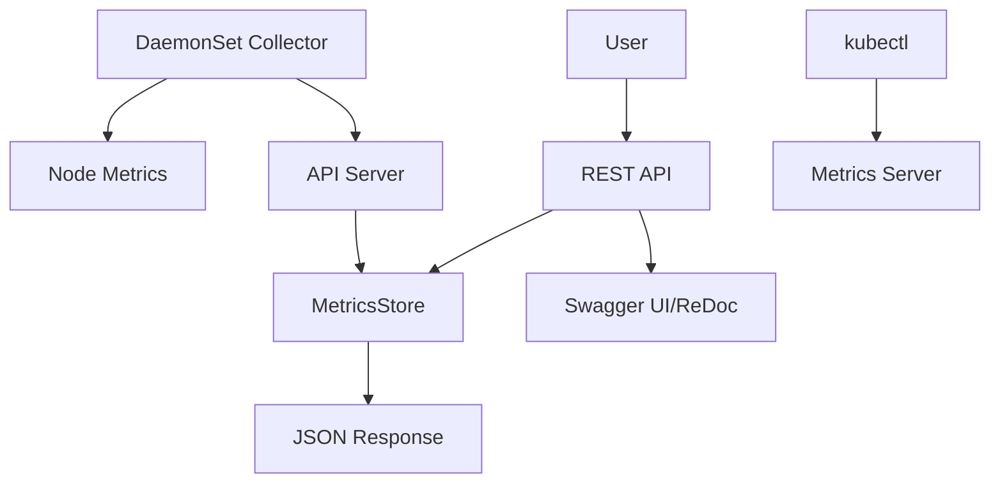

# Kubernetes 모니터링 서비스 (kubemonitor)

> WSL Ubuntu 22.04 LTS 환경에서 Kubernetes 기반 클라우드 모니터링 서비스를 완전 자동화로 구축하는 프로젝트

## 📋 프로젝트 개요

이 프로젝트는 Kubernetes 클러스터의 노드와 포드 리소스 사용량을 실시간으로 모니터링하는 완전한 시스템입니다. DaemonSet으로 배포되는 Collector가 각 노드의 CPU, 메모리, 디스크, 네트워크 메트릭을 수집하고, FastAPI 기반 서버를 통해 REST API로 제공합니다.

## 🏗️ 프로젝트 구조

```
kubemonitor/
├── collector/
│ ├── collector.py # DaemonSet용 리소스 수집 스크립트
│ ├── requirements.txt # Python 라이브러리: requests
│ └── Dockerfile.collector # Collector용 Dockerfile
├── api/
│ ├── main.py # FastAPI 앱 엔트리포인트
│ ├── models.py # Pydantic 모델 정의
│ ├── storage.py # 시계열 데이터 저장소 추상화
│ ├── requirements.txt # Python 라이브러리: fastapi, uvicorn, pydantic
│ └── Dockerfile.api # API 서버용 Dockerfile
├── deploy/
│ └── monitor.yaml # Kubernetes 배포 매니페스트
├── scripts/ # 자동화 스크립트 모음
│ ├── 00-setup-all.sh # 전체 환경 자동 구축 스크립트
│ ├── 01-setup-environment.sh # 개발 환경 구축
│ ├── 02-build-images.sh # Docker 이미지 빌드
│ ├── 03-deploy.sh # Kubernetes 배포
│ ├── 04-test.sh # 시스템 테스트
│ ├── 05-test-api.sh # API 테스트
│ ├── 05-test-api-with-save.sh # API 테스트 결과 저장
│ ├── 06-comprehensive-test-with-kubectl # API 테스트 및 kubectl 결과 저장
│ ├── kube-port-forward.sh # 포트 포워딩
│ └── shutdown_all_settings.sh # 전체 종료
├── result/ # 테스트 결과 저장소
│ └── api-test-2025-06-10-15-13-36.txt # API 테스트 결과 (21090라인)
├── docs/
│ ├── report.md # 이 보고서 파일
│ └── PRD.md # 요구사항 명세서
├── .gitignore # Git 무시 파일 목록
└── README.md # 프로젝트 설명서
```

## 🚀 빠른 시작

### 🎯 원클릭 자동 설치 (권장)

Clean Ubuntu 22.04 LTS에서 전체 시스템을 자동으로 구축하려면:

```bash
# 프로젝트 클론
git clone <repository-url>
cd kubemonitor

# 스크립트 실행 권한 부여
chmod +x scripts/*.sh

# 전체 자동 설치 (개발환경 구축 + 빌드 + 배포 + 테스트)
./scripts/setup-all.sh
```

### 📋 단계별 수동 설치

각 단계를 개별적으로 실행하려면:

```bash
# 1단계: 개발 환경 구축 (Clean Ubuntu 기준)
./scripts/01-setup-environment.sh

# 2단계: Docker 이미지 빌드
./scripts/02-build-images.sh

# 3단계: Kubernetes 배포
./scripts/03-deploy.sh

# 4단계: 기본 시스템 테스트
./scripts/04-test.sh

# 5단계: API 테스트 (결과 저장)
./scripts/05-test-api-with-save.sh

# 6단계: 종합 테스트 (API + kubectl 비교 검증)
./scripts/06-comprehensive-test-with-kubectl.sh
```

### 🔧 고급 옵션

특정 단계를 건너뛰고 싶다면:

```bash
# 개발 환경 구축 건너뛰기 (이미 설치된 경우)
./scripts/setup-all.sh --skip-env

# 빌드 단계 건너뛰기 (이미지가 있는 경우)
./scripts/setup-all.sh --skip-build

# 여러 단계 건너뛰기
./scripts/setup-all.sh --skip-env --skip-build
```

### 전제 조건
- WSL Ubuntu 22.04 LTS (Clean 설치 권장)
- 인터넷 연결
- sudo 권한

## 🧪 테스트 스크립트

### 종합 테스트 (권장)
```bash
# API 호출과 kubectl 명령어 결과를 비교 검증
./scripts/06-comprehensive-test-with-kubectl.sh
```

**주요 기능:**
- 🔍 API URL 자동 감지 (minikube service 우선 사용)
- 📊 Metrics Server 상태 자동 확인 및 활성화
- 🎯 스마트 API 응답 요약 (models.py 구조 기반)
- 📋 모든 API 엔드포인트 테스트
- 🔄 kubectl 명령어와 실시간 비교
- 💾 전체 데이터는 로그 파일에 완전 보존
- 🎨 색상 출력으로 가독성 향상

**생성되는 파일:**
- `result/comprehensive-test-TIMESTAMP.txt` - 종합 테스트 결과
- `result/kubectl-output-TIMESTAMP.txt` - kubectl 전용 로그

### 기본 테스트
```bash
# 간단한 API 테스트
./scripts/04-test.sh

# API 테스트 (결과 저장)
./scripts/05-test-api-with-save.sh
```

## 🔧 주요 기능

### 메트릭 수집
- **CPU 사용량**: cgroup cpuacct.usage 기반 (밀리코어 단위)
- **메모리 사용량**: /proc/meminfo 파싱
- **디스크 I/O**: cgroup blkio 통계
- **네트워크 트래픽**: /proc/net/dev 파싱

### API 엔드포인트

#### 🖥️ 노드 기준
- `GET /api/nodes` - 전체 노드 목록 및 리소스 사용량
- `GET /api/nodes/{node_name}` - 특정 노드의 리소스 사용량 (호스트 프로세스 포함)
- `GET /api/nodes/{node_name}/pods` - 해당 노드에 할당된 모든 포드 목록 (포드만)
- `GET /api/nodes/{node_name}?window=60` - 노드 시계열 데이터 (60초간)
- `POST /api/nodes/{node_name}` - 메트릭 수집 (Collector 전용)

#### 🐳 포드 기준
- `GET /api/pods` - 전체 포드 목록 및 리소스 사용량
- `GET /api/pods/{pod_name}` - 특정 포드의 실시간 리소스 사용량
- `GET /api/pods/{pod_name}?window=300` - 포드 시계열 데이터 (300초간)
- `POST /api/pods/{pod_name}` - 포드 메트릭 수집

#### 📁 네임스페이스 기준
- `GET /api/namespaces` - 전체 네임스페이스 목록 및 리소스 사용량 (네임스페이스 내 모든 포드 리소스 합)
- `GET /api/namespaces/{ns_name}` - 특정 네임스페이스의 리소스 사용량
- `GET /api/namespaces/{ns_name}/pods` - 해당 네임스페이스의 포드 목록 및 리소스 사용량
- `GET /api/namespaces/{ns_name}?window=60` - 네임스페이스 시계열 데이터

#### 🚀 디플로이먼트 기준
- `GET /api/namespaces/{ns_name}/deployments` - 해당 네임스페이스의 디플로이먼트 목록 및 리소스 사용량 (디플로이먼트 내 모든 포드 리소스 합)
- `GET /api/namespaces/{ns_name}/deployments/{dp_name}` - 해당 디플로이먼트의 리소스 사용량
- `GET /api/namespaces/{ns_name}/deployments/{dp_name}/pods` - 디플로이먼트 내 포드 목록 및 리소스 사용량

#### ⏰ 시계열 조회
- `GET /api/nodes?window={seconds}` - 노드 시계열 데이터
- `GET /api/pods?window={seconds}` - 포드 시계열 데이터
- `GET /api/namespaces/{ns_name}?window={seconds}` - 특정 네임스페이스 시계열 데이터

#### 🏥 헬스 체크
- `GET /health` - API 서버 상태 확인

## 💡 CPU 단위 설명

API에서 사용하는 CPU 단위는 **밀리코어(millicores)**입니다:
- **1 코어 = 1000m (밀리코어)**
- **1m = 0.001 코어**
- **예시**: `cpu_millicores: 124389` = **124.389 CPU 코어**

kubectl과의 차이점:
- **API**: 누적/평균 데이터, cgroup 기반 상세 메트릭
- **kubectl**: 실시간 스냅샷, Metrics Server 기반

## 🧪 성능 테스트

### CPU 부하 테스트
```bash
kubectl run stress-test --image=progrium/stress -- stress --cpu 2 --timeout 60s
curl "http://$(minikube ip):30080/api/nodes/$(kubectl get nodes -o jsonpath='{.items[0].metadata.name}')"
```

### 디스크 I/O 테스트
```bash
kubectl run disk-test --image=busybox -- /bin/sh -c "dd if=/dev/zero of=/tmp/testfile bs=1M count=100"
```

### 네트워크 부하 테스트
```bash
kubectl run iperf3-server --image=networkstatic/iperf3 -- iperf3 -s
kubectl run iperf3-client --image=networkstatic/iperf3 -- iperf3 -c iperf3-server -t 30
```

## 📊 아키텍처



### 주요 컴포넌트

1. **Collector (DaemonSet)**
   - 각 노드에서 실행
   - 호스트 파일시스템 마운트 (`/sys/fs/cgroup`, `/proc`)
   - 5초마다 메트릭 수집 및 API 전송

2. **API Server (Deployment)**
   - FastAPI 기반 REST API
   - Pydantic 모델을 통한 데이터 검증
   - 인메모리 시계열 데이터 저장
   - Swagger UI/ReDoc 자동 생성

3. **Storage Layer**
   - 인메모리 딕셔너리 기반
   - 시계열 쿼리 지원 (window 파라미터)
   - 노드/포드/네임스페이스/디플로이먼트별 데이터 구분

## 🔍 모니터링 대시보드

API 문서를 통해 대화형으로 테스트할 수 있습니다:

```bash
# Swagger UI
http://$(minikube ip):30080/docs

# ReDoc
http://$(minikube ip):30080/redoc
```

## 🛠️ 개발 가이드

### 로컬 개발 환경

```bash
# Collector 로컬 실행
cd collector
python3 -m venv venv && source venv/bin/activate
pip install -r requirements.txt
python collector.py

# API 서버 로컬 실행
cd ../api
python3 -m venv venv && source venv/bin/activate
pip install -r requirements.txt
uvicorn main:app --host 0.0.0.0 --port 8080 --reload
```

### 로그 확인

```bash
# Collector 로그
kubectl logs -l app=resource-collector

# API 서버 로그
kubectl logs -l app=monitor-api

# 실시간 로그 스트리밍
kubectl logs -f -l app=resource-collector
```

## 🚨 트러블슈팅

### 일반적인 문제

1. **Metrics Server 사용 불가**
   ```bash
   # 자동 활성화 (종합 테스트 스크립트가 자동 처리)
   minikube addons enable metrics-server
   kubectl get pods -n kube-system | grep metrics-server
   ```

2. **이미지 Pull 실패**
   ```bash
   # 이미지가 Minikube에 로드되었는지 확인
   minikube image ls | grep kubemonitor
   ```

3. **API 연결 실패**
   ```bash
   # Service 상태 확인
   kubectl get svc monitor-api-nodeport
   minikube service monitor-api-nodeport --url
   ```

4. **권한 오류**
   ```bash
   # DaemonSet이 privileged 모드로 실행되는지 확인
   kubectl describe daemonset resource-collector
   ```

### 디버깅 명령어

```bash
# 포드 상태 확인
kubectl get pods -o wide

# 노드 리소스 확인
kubectl top nodes

# 이벤트 확인
kubectl get events --sort-by=.metadata.creationTimestamp

# API 응답 직접 테스트
curl "http://$(minikube ip):30080/health"
```

## 📈 성능 최적화

- **리소스 제한**: 각 컴포넌트에 적절한 CPU/메모리 제한 설정
- **수집 간격**: 환경변수 `COLLECT_INTERVAL`로 조정 가능
- **데이터 보관**: 메모리 사용량 고려하여 오래된 데이터 자동 삭제 로직 구현 권장
- **출력 최적화**: 종합 테스트 스크립트는 화면 출력을 요약하고 전체 데이터는 파일에 저장

## 🔍 테스트 결과 분석

종합 테스트 실행 후 생성되는 파일들:
- **종합 결과**: API 응답 요약과 kubectl 비교
- **kubectl 로그**: 모든 kubectl 명령어 출력
- **API 전체 응답**: JSON 형태로 완전 보존

테스트 결과에서 확인할 수 있는 정보:
- API와 kubectl 간 데이터 일관성 검증
- 시계열 데이터 수집 상태
- 메트릭 집계 정확성 (네임스페이스, 디플로이먼트별)

## 🤝 기여하기

1. Fork 프로젝트
2. Feature 브랜치 생성 (`git checkout -b feature/amazing-feature`)
3. 변경사항 커밋 (`git commit -m 'Add amazing feature'`)
4. 브랜치에 Push (`git push origin feature/amazing-feature`)
5. Pull Request 생성

## 📄 라이선스

이 프로젝트는 MIT 라이선스 하에 있습니다. 자세한 내용은 [LICENSE](LICENSE) 파일을 참조하세요.

## 📞 지원

- 📧 이메일: [이메일 주소]
- 🐛 버그 리포트: [GitHub Issues](링크)
- 💬 토론: [GitHub Discussions](링크)

---

**참고**: 이 프로젝트는 교육 및 데모 목적으로 제작되었습니다. 프로덕션 환경에서 사용하기 전에 보안 검토 및 성능 테스트를 수행하시기 바랍니다. 